# Mermaid 图表指南

本文件提供教学文档中常用的 Mermaid 图表类型、写法示例和使用场景。
Mermaid 语法被语雀、飞书、Notion、GitHub、Typora 等主流云笔记和 Markdown 编辑器原生支持。

---

## 目录

1. [流程图 Flowchart](#流程图-flowchart)
2. [时序图 Sequence Diagram](#时序图-sequence-diagram)
3. [状态图 State Diagram](#状态图-state-diagram)
4. [类图 Class Diagram](#类图-class-diagram)
5. [ER 图 Entity Relationship Diagram](#er-图-entity-relationship-diagram)
6. [甘特图 Gantt](#甘特图-gantt)
7. [使用场景速查表](#使用场景速查表)
8. [写作技巧](#写作技巧)

---

## 流程图 Flowchart

最常用的图表类型。适合展示算法步骤、决策流程、系统架构。

### 基本语法

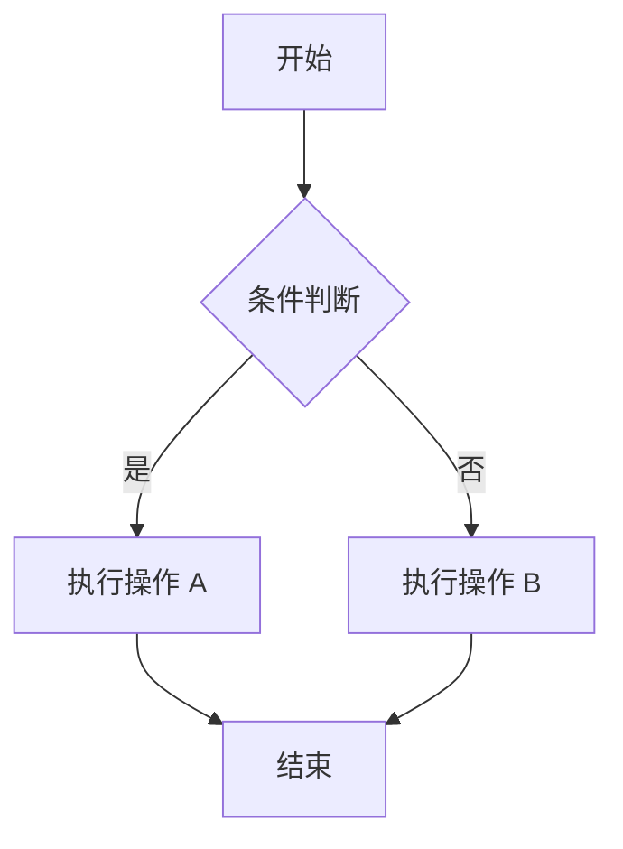

### 节点形状

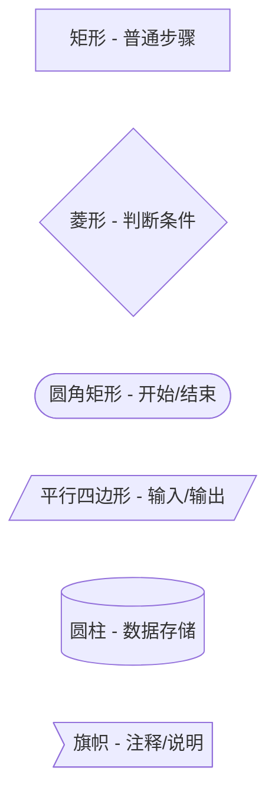

### 示例：二分查找流程

```mermaid
flowchart TD
    Start([开始]) --> Init["left=0, right=n-1"]
    Init --> Loop{left <= right?}
    Loop -->|否| NotFound["返回 -1（未找到）"]
    Loop -->|是| Calc["mid = (left + right) / 2"]
    Calc --> Compare{arr[mid] vs target}
    Compare -->|arr[mid] == target| Found["返回 mid"]
    Compare -->|arr[mid] < target| MoveLeft["left = mid + 1"]
    Compare -->|arr[mid] > target| MoveRight["right = mid - 1"]
    MoveLeft --> Loop
    MoveRight --> Loop
    Found --> End([结束])
    NotFound --> End
```

### 示例：模拟数据结构

用 flowchart 可以模拟树形结构：

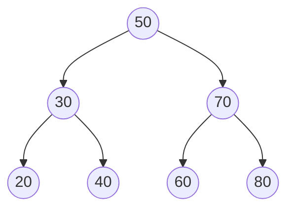

链表结构：


---

## 时序图 Sequence Diagram

适合展示组件间交互、网络协议通信、函数调用链。

### 基本语法

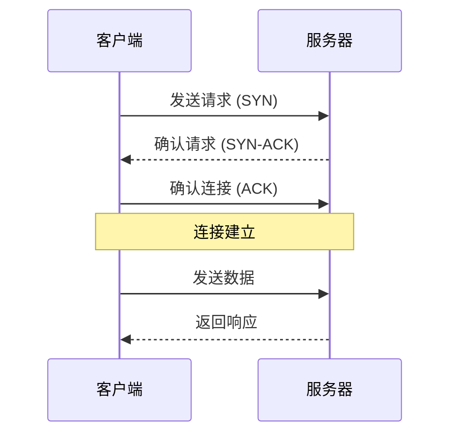

### 示例：TCP 三次握手

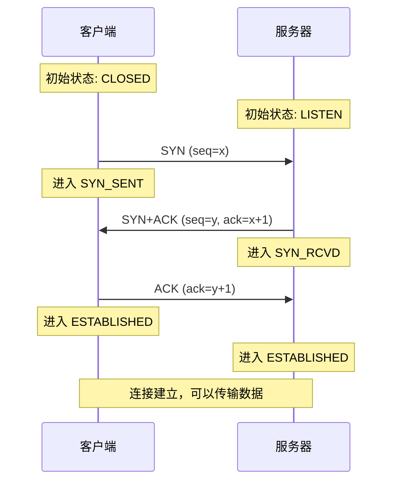

### 示例：HTTP 请求生命周期

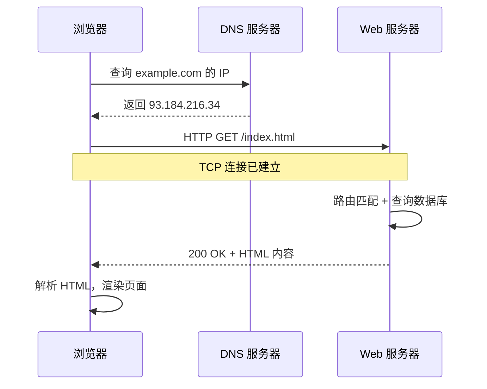

### 高级用法

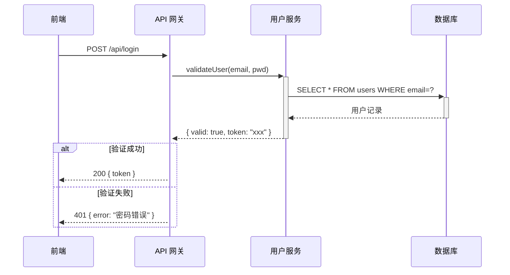

---

## 状态图 State Diagram

适合展示对象状态转换、协议状态机、生命周期。

### 基本语法

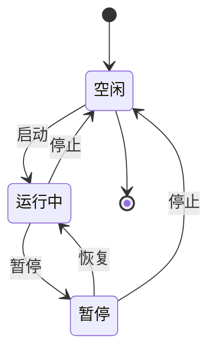

### 示例：进程状态转换

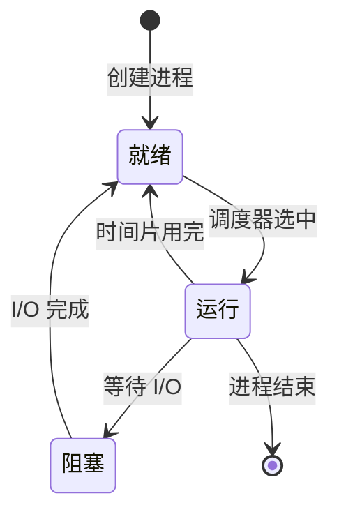

### 示例：HTTP 请求状态

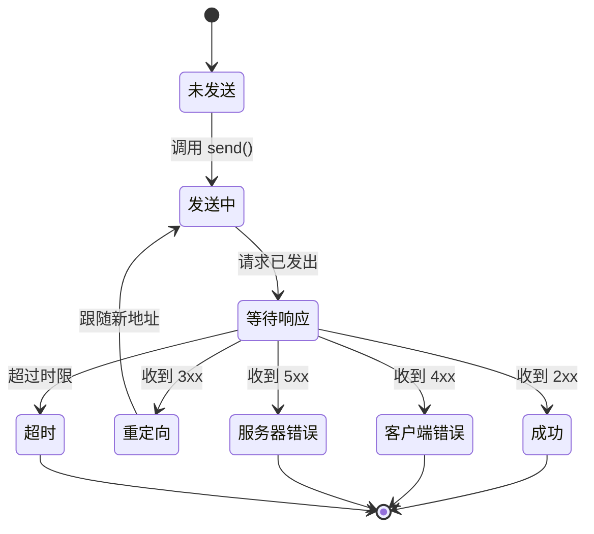

---

## 类图 Class Diagram

适合展示面向对象设计、类继承关系、设计模式结构。

### 基本语法

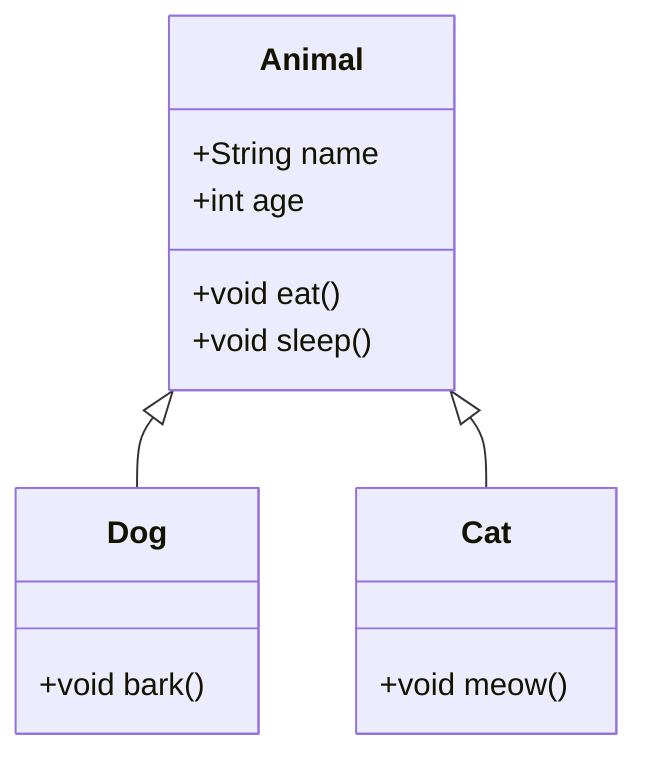

### 示例：设计模式——观察者模式

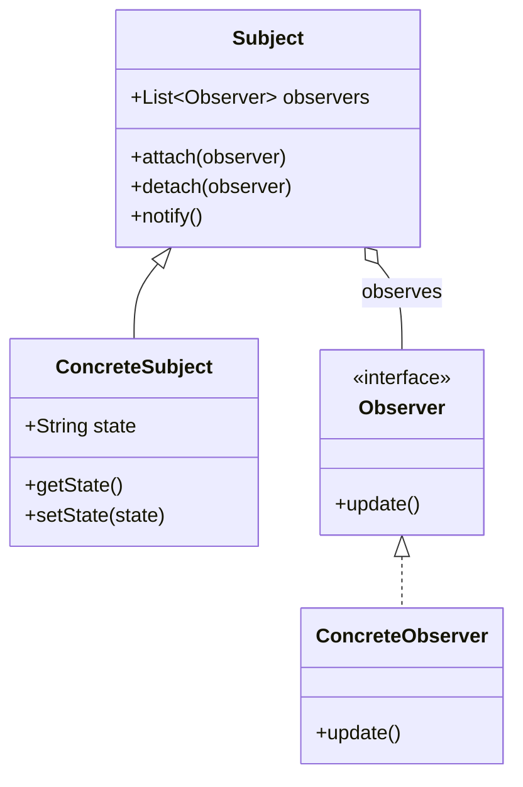

### 关系类型说明

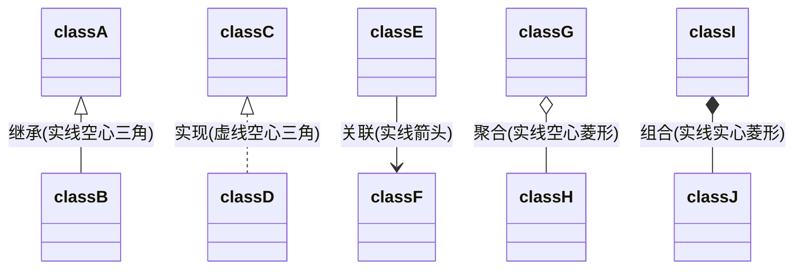

---

## ER 图 Entity Relationship Diagram

适合展示数据库表结构、实体关系。

### 基本语法

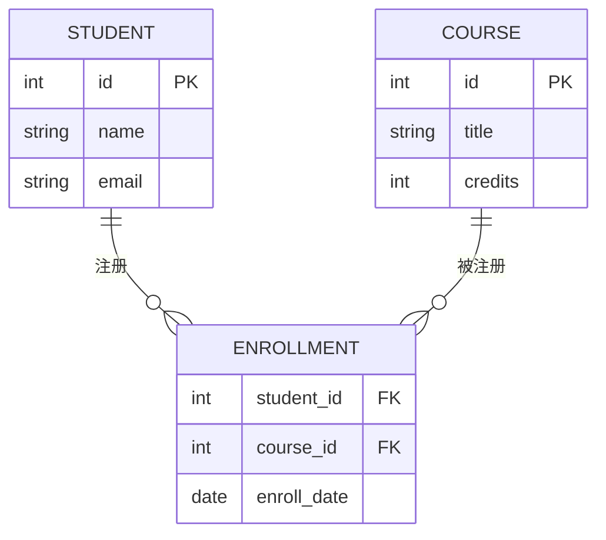

### 关系基数

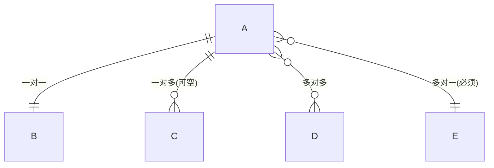

---

## 甘特图 Gantt

适合展示项目计划、开发周期、课程进度安排。

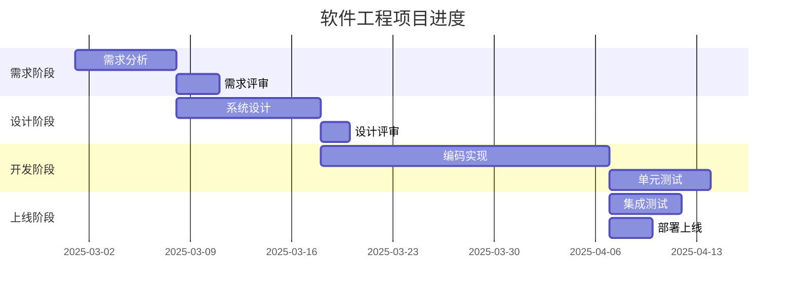

---

## 使用场景速查表

| 知识点类型 | 推荐图表 | 说明 |
|-----------|---------|------|
| 排序/查找算法 | flowchart | 展示算法步骤和分支判断 |
| 树/图/链表结构 | flowchart | 模拟数据结构的节点和指针 |
| TCP/HTTP 等协议 | sequenceDiagram | 展示通信时序和消息交互 |
| 函数调用链 | sequenceDiagram | 展示模块间调用关系 |
| 进程/线程状态 | stateDiagram | 展示状态转换和触发条件 |
| 对象生命周期 | stateDiagram | 展示对象从创建到销毁 |
| 面向对象设计 | classDiagram | 展示类继承、接口实现、关联关系 |
| 设计模式 | classDiagram | 展示模式中各角色及其关系 |
| 数据库设计 | erDiagram | 展示表结构和外键关系 |
| 项目管理/课程计划 | gantt | 展示时间线和任务依赖 |

---

## 写作技巧

### 1. 图表要有标题和说明

在 Mermaid 代码块前面用一句话说明"这张图展示了什么"，后面用一段话解读图中关键信息。

```markdown
下面的流程图展示了快速排序的一次完整执行过程：

​```mermaid
flowchart TD
    ...
​```

注意图中分区操作的三个关键步骤：选基准、遍历比较、交换位置。这就是一次完整的 partition。
```

### 2. 图表不要太复杂

如果一张图超过 15 个节点，考虑拆成多张图。学生的认知负荷有限，一张图讲清楚一个要点即可。

### 3. 用注释补充上下文

Mermaid 支持在图中添加 Note，善用它来标注关键信息：

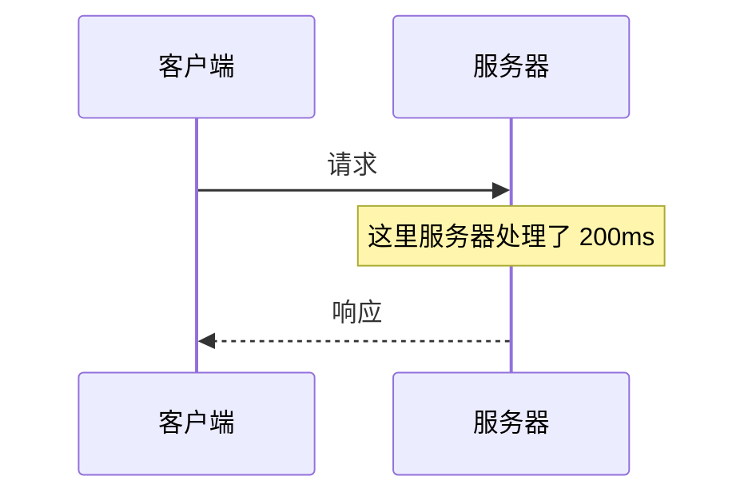

### 4. 中文节点名

Mermaid 完全支持中文节点名，但注意用引号包裹包含特殊字符的文本：

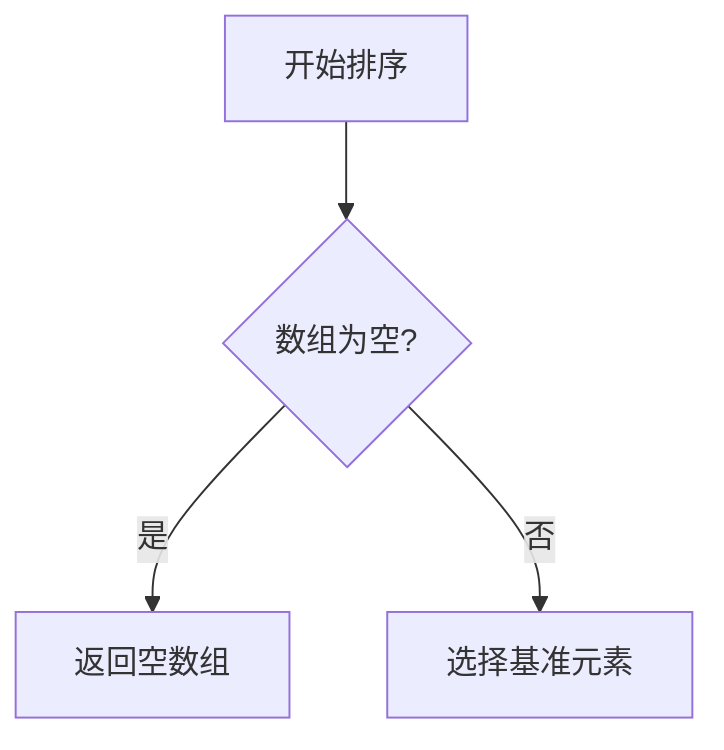

### 5. 颜色提示

可以用 `style` 给关键节点加颜色，突出重点：

```mermaid
flowchart TD
    A[开始] --> B[处理数据]
    B --> C{是否出错?}
    C -->|否| D[返回结果]
    C -->|是| E[抛出异常]

    style E fill:#f96,stroke:#333,stroke-width:2px
    style D fill:#9f9,stroke:#333,stroke-width:2px
```
